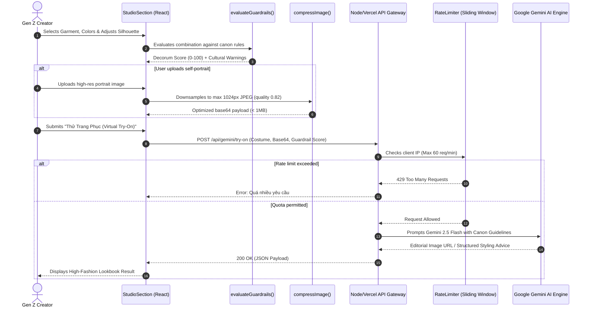

# Technical Architecture Documentation: VietHeritage Remix

VietHeritage Remix is a modern web application dedicated to digitizing, styling, and co-creating traditional Vietnamese garments (*Cổ phục Việt Nam*) for Generation Z. The project blends historical fidelity (*Khâm Định Đại Nam Hội Điển Sự Lệ*, EFEO archives) with contemporary editorial design and AI-assisted customization.

This document details the architectural principles, component structure, state management, security boundaries, and data flow of the application.

---

## 1. Feature-Sliced Design (FSD) Architecture

The frontend follows Feature-Sliced Design (FSD) architecture principles, decomposing the system into clearly delineated layers with strict dependency rules:

```
src/
├── app/                  # Application initialization, root providers, shell composition
│   ├── App.tsx           # Top-level view composition, layout orchestrator, skip link
│   ├── main.tsx          # React 19 DOM root mounting
│   └── providers.tsx     # Context providers wrapper
│
├── features/             # Business domains and interactive user journeys
│   ├── anatomy/          # 2D Layered Anatomy Flaps inspection (flaps, garment layers)
│   ├── chat/             # Gemini AI Cultural Advisor interactive chat drawer
│   ├── community/        # Community lookbook gallery, liking, and remixing
│   ├── heritage-map/     # Leaflet.js territorial sovereignty map and cultural coordinates
│   ├── home/             # Hero banner, entry CTA triggers
│   ├── museum/           # Digital museum gallery, costume carousel & historical inspection
│   ├── studio/           # AI Personal Color analysis, Virtual Try-On, 1200x1800 photocard export
│   ├── timeline/         # Dynastic historical timeline (Lý, Trần, Lê, Nguyễn)
│   ├── wardrobe/         # Saved outfits drawer and local inventory
│   └── wisdom/           # Cultural wisdom and proverb carousel
│
└── shared/               # Reusable primitives, domain types, utilities, and assets
    ├── components/       # Cross-feature UI elements (Navbar, Footer)
    ├── data/             # Historical datasets (costumes, dyes, destinations)
    ├── hooks/            # Custom React hooks (useAudio)
    ├── i18n/             # Bilingual dictionaries (Vietnamese & English)
    ├── lib/              # Core business algorithms (guardrails, personalColor, imageCompression, storage)
    └── types/            # TypeScript interfaces and domain models
```

### Dependency Rules:
1. `shared` has zero dependencies on `features` or `app`.
2. `features` only import from `shared` or cross-communicate via events/props passed down by `app`.
3. `app` composes `features` and `shared` into a unified application lifecycle.

---

## 2. State Management & Custom Hooks

The application adopts a lightweight, zero-boilerplate state architecture leveraging React 19 primitives:

- **Local State (`useState`, `useRef`)**: Encapsulates component-specific interactive state (e.g., active tabs, accordion open states, preview sliders).
- **Audio Synthesis (`useAudio`)**:
  - Implements the Web Audio API without external audio files.
  - Dynamically synthesizes the Vietnamese pentatonic scale (*thang âm ngũ cung*: C4, D4, F4, G4, A4, C5, D5, F5).
  - Simulates the plucked timbre of the Vietnamese 16-string zither (*Đàn Tranh*) using triangle oscillators and custom ADSR gain nodes.
  - Exposes `{ isPlaying, toggle }` with automatic lifecycle cleanups upon unmount.
- **Client Persistence (`storageHelper`)**:
  - Safe browser abstraction checking for SSR environments (`typeof window !== 'undefined'`).
  - Manages community lookbook creations, like counts, and guest profiles in `localStorage`.

---

## 3. Data Flow Architecture

### Cultural Guardrail Evaluation & AI Virtual Try-On Pipeline



---

## 4. API & Security Architecture

### 4.1 Server Handlers & Endpoints
The backend is abstracted into decoupled functional handlers (`server/handlers.ts`) used uniformly by Express (`server.ts`), Vite Dev Server (`vite.config.ts`), and Vercel Serverless Functions (`api/`):

- `GET /api/gemini/status`: Inspects Gemini model availability and offline fallback mode.
- `POST /api/gemini/chat`: Handles conversational inquiries with prompt injection protection.
- `POST /api/gemini/styling`: Generates personalized advice based on season, body shape, and weather.
- `POST /api/gemini/try-on`: Processes virtual try-on requests with payload size verification.

### 4.2 Security Boundaries
- **Sliding-Window Rate Limiting**:
  - An in-memory rate limiter tracking client IP addresses.
  - Limits traffic to 60 requests per minute per IP.
  - Automatically cleans expired keys when map size exceeds 5,000 entries.
- **Client-Side Image Optimization**:
  - Automatically compresses user photos to a maximum dimension of 1024px JPEG at 82% quality using HTML5 Canvas.
  - Prevents network exhaustion and rejects payloads over 10MB (`413 Payload Too Large`).
- **Content Security Policy (CSP)**:
  - Enforced via `vercel.json` and production server headers.
  - Restricts origins to trusted CDNs (CartoDB tiles, Leaflet, Google Fonts, Unsplash).
  - Enforces `frame-ancestors 'none'`, `X-Frame-Options: DENY`, `X-Content-Type-Options: nosniff`.

---

## 5. Verification & Testing Strategy

The repository includes a comprehensive automated test suite powered by the Node.js native test runner and `tsx`:

```bash
npm test
```

### Test Coverage Suites (17 Automated Tests):
1. **`tests/guardrails.test.ts` (5 tests)**:
   - Validates canon outfits with 0 breaches.
   - Detects improper short bottoms with traditional robes (`ERR_NGU_THAN_SHORT`).
   - Detects funerary *Tả Nhậm* lapel inversions (`ERR_GIAO_LINH_COLLAR`).
   - Enforces decorum for sacred destinations (temples, citadels).
   - Validates score degradation clamping.
2. **`tests/personalColor.test.ts` (4 tests)**:
   - Evaluates 4-season undertone analysis (Spring, Summer, Autumn, Winter).
   - Validates fallbacks for unspecified undertones.
   - Tailors silhouette advice across diverse body shapes.
   - Maps natural traditional dyes (Củ Nâu, Hoàng Đằng, Chàm, Son).
3. **`tests/rateLimiter.test.ts` (4 tests)**:
   - Validates quota allowances up to configured threshold.
   - Enforces `429 Too Many Requests` when quota is breached.
   - Confirms automatic sliding window expiry.
   - Tests memory eviction on cache capacity overflow.
4. **`tests/storage.test.ts` (4 tests)**:
   - Validates SSR resilience when `window` is undefined.
   - Verifies seeding of community looks on cold start.
   - Tests local look persistence and like increments.
   - Handles corrupted storage gracefully.

### Quality Verification Pipeline:
```bash
npm run verify
```
Executes TypeScript type checking (`npm run lint`), runs all 17 automated tests (`npm test`), and builds optimized production bundles (`npm run build`).
